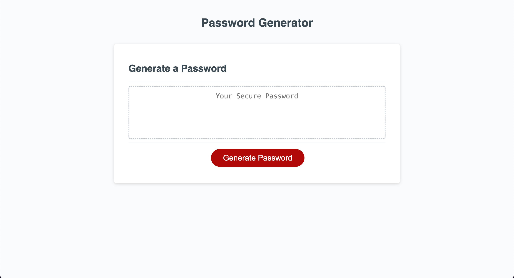
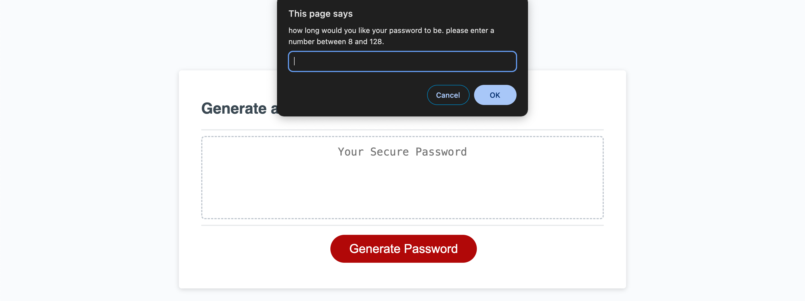
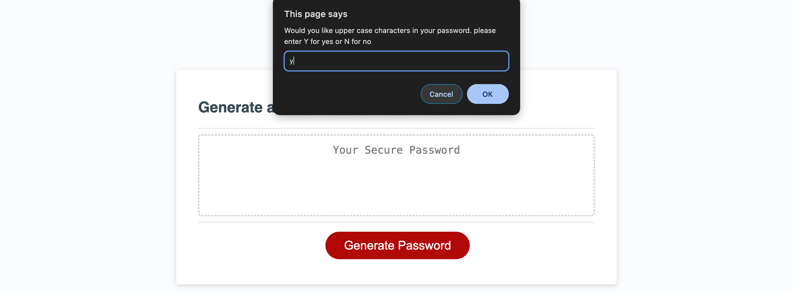
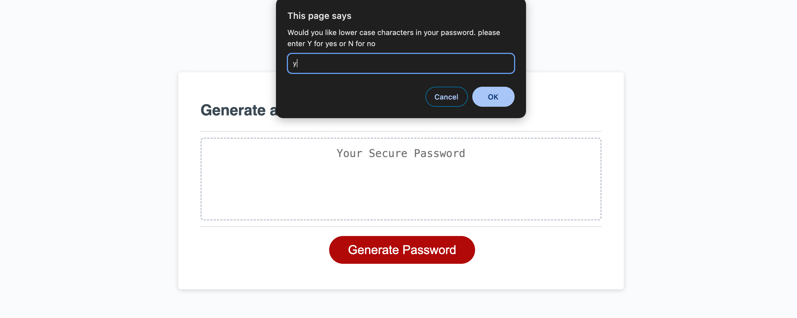
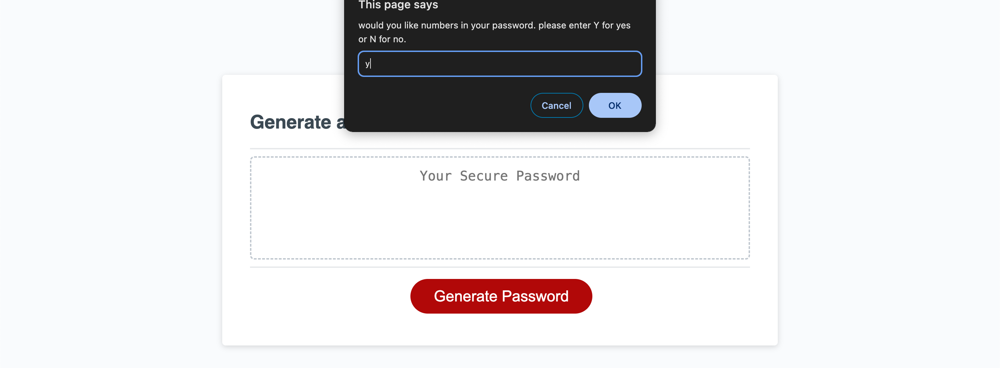
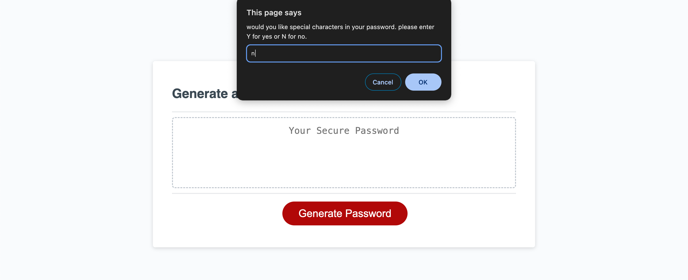
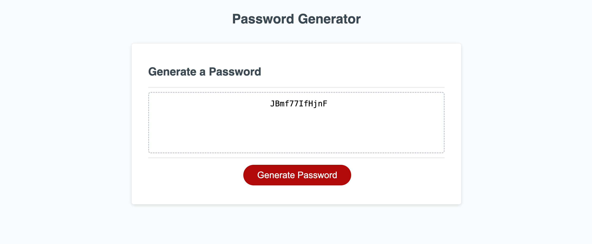

# week-3-challenge

# this weeks challenge was to edit the js code so that it outputs a random password everytime the user clicks generate.

# the way i accomplished this was by using 5 functions. 

- One was for the length. it did validation for data type and length checks.

- the rest were for user preferences like whether or not they wanted uppercase letter, lowercase letter, numbers or special characters. it did validation for data type and changed the char variable to store all preferences that were selected. for example if user selected numbers and lowercase letters, it would store all lowercase letters and numbers from 0-9 in the char variable.

# preference check

- the code also made sure that the user selected at least one prefenece or else it would alert them and loop until they selected one.

# random character selector

- the last addition to the js code was a for loop that carried on while it was less than users desired length. 
in the for loop was code that chose a random character in the char variable where all the selected preferences were and added it to the genpassword variable.

# screenshots of working application

- this is the page when first loaded 

- this is the page when you click generate

- this is the page when entering uppercase preference

- this is the page when entering lowercase preference

- this is the page when entering numbers preference

- this is the page when entering special characters preference

- this is page at end when user enters all preferences

# link to working page
